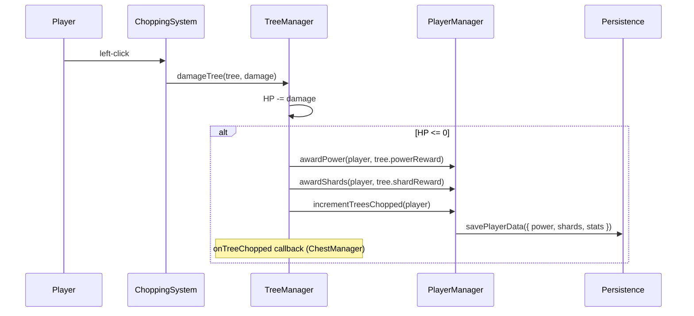

# Cut Trees – Context Summary (2025-02-16)

Purpose: Comprehensive context summary of the economy-tuning and shards-per-tree implementation session for downstream agents and future work.

---

## 2. Architectural Goal

Align Cut Trees’ in-game currency (shards) with research-backed retention targets. The prior economy was **disjoint**: shards came only from duplicate axe rolls when opening chests, while planned Item Shop prices (10k–1M shards) would require hundreds of hours to reach. We introduced a **predictable shard stream** (tree chops) alongside the existing **variable stream** (duplicate axes) so that (a) every chop feels rewarding, (b) first shop purchase is reachable in 2.5–4 hours, and (c) the dual-stream design (predictable + variable) matches operant-conditioning research for engagement.

---

## 3. Change Log

| Commit / PR ID | Layer | Filepath | +/- LOC | One-line description |
|----------------|-------|----------|---------|----------------------|
| 5779496 | Docs | `docs/economy-tuning.md` | +207 | New economy tuning doc with retention research and time-to-reward targets |
| 5779496 | Docs | `docs/economy-and-shops.md` | ~5 | Document tree chop + duplicate axe as shard sources |
| 5779496 | Docs | `docs/environment-and-map-building.md` | +~90 | (pre-existing) |
| 5779496 | Docs | `docs/local-connection-and-cors.md` | +~65 | (pre-existing) |
| 5779496 | Docs | `docs/ui-icons.md` | +~60 | (pre-existing) |
| 5779496 | Docs | `docs/ui-styling-review.md` | +~145 | (pre-existing) |
| 469b928 | Game Config | `src/game/trees.ts` | +28 | Add SHARD_BASE_BY_TIER, shardMultiplier, shardReward in applyWorldMultipliers |
| 469b928 | Systems | `src/systems/treeManager.ts` | +6 | Add shardReward to TreeInstance; award shards on chop |

---

## 4. Deep-Dive Highlights

**Shards-per-tree formula:** `Shards = Base(tier) × World Multiplier`. Tier bases: 1 (small), 2 (medium), 4 (large/palm). World multiplier: Forest 1×, Lava 3×. Implemented in `applyWorldMultipliers()` in `src/game/trees.ts` and stored per-tree in `TreeInstance.shardReward`.

**Critical code path:** `TreeManager.chopTree()` → `PlayerManager.awardPower()` + `PlayerManager.awardShards(tree.shardReward)` → `savePlayerData()`. Tree instance gets `shardReward` from `applyWorldMultipliers()` at spawn time (```125:128:src/systems/treeManager.ts```).

**Tricky edge:** `totalShardsClaimed` in stats includes both tree-earned and duplicate-earned shards. No separate analytics field yet; optional follow-up is `stats.shardsFromTrees`.

**Performance:** One extra `awardShards` call per chop; trivial overhead. No change to persistence volume beyond shard increments.

---

## 5. Data-Flow / Sequence Diagram



---

## 6. Label & Schema Reference

| Label / Schema | Description |
|----------------|-------------|
| `SHARD_BASE_BY_TIER` | `Record<TreeTier, number>` — 1, 2, 4, 4 for tiers 1–4 |
| `shardMultiplier` | World multiplier in `WorldMultipliers` — Forest 1, Lava 3 |
| `shardReward` | Per-tree reward from `applyWorldMultipliers()` — `Math.round(baseShards * shardMultiplier)` |
| `TreeInstance.shardReward` | Stored at spawn; used in `chopTree()` |
| `PlayerData.shards` | Persistent; incremented by tree chops and duplicate chest rolls |
| `stats.totalShardsClaimed` | Includes all shard sources |

---

## 7. Outstanding Work & Next Tasks

1. **Add "+X Shards" popup on tree chop** — P1 — Match "+X Power" feedback for immediate reinforcement.
2. **Playtest and tune SHARD_BASE_BY_TIER** — P1 — Validate 2.5–4 hr target for first 10k shards; adjust if pacing feels off.
3. **Optional: `stats.shardsFromTrees`** — P2 — Separate analytics for tree vs chest shards if needed.
4. **Implement Item Shop** — P0 — Wire shopItems.ts, purchase handlers, and UI per `docs/economy-and-shops.md`.

---

## 8. Decision Log

- **Decision:** Add shards per tree chop as a second shard source. **Rationale:** Research shows predictable base + variable bonus maximizes engagement; prior economy made shop prices unreachable. **Alternatives:** Keep single stream and lower prices — rejected: would trivialize chest duplicate value.
- **Decision:** Use tier-based base (1/2/4/4) and world multiplier (Forest 1×, Lava 3×). **Rationale:** Mirrors Roblox Cut Trees formula (Base × World); keeps progression feel. **Alternatives:** Flat 2 shards/tree — rejected: less progression variety.
- **Decision:** Document in `docs/economy-tuning.md` with research citations. **Rationale:** Targets should be auditable; downstream agents need rationale for numbers. **Alternatives:** Inline comments only — rejected: cross-file, needs standalone reference.

---

## 9. Risks & Mitigations

| Risk | Mitigation |
|------|------------|
| Shard inflation from tree chops trivializes chests | Duplicate shards remain variable-ratio; chests still best path to axes. Monitor playtest feedback. |
| Tuning off (too fast/slow) | `SHARD_BASE_BY_TIER` and world multipliers are in config; easy to iterate. |
| Build artifact `index.mjs` in repo | In `.gitignore`; if tracked historically, consider `git rm --cached`. |

---

## 10. Appendix

- **Economy tuning:** `docs/economy-tuning.md`
- **Shop design:** `docs/economy-and-shops.md`
- **References:** Spaceport (Roblox retention), Game Developer (first session), Skinner/Andrew Chen (variable ratio), Machinations (incremental pacing), Cut Trees community guide (Coins formula)
