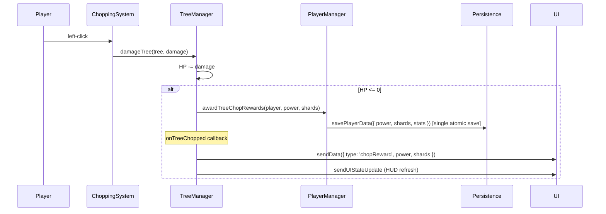

# Cut Trees – Context Summary (2026-02-17)

Purpose: Context summary of the economy code review and improvements session.

---

## 1. Session Goal

Review the shard-per-tree-chop implementation (from 2/16) for correctness and code quality, then fix all identified issues.

---

## 2. Issues Identified & Resolved

### 2.1 Triple save per chop (fixed)

**Problem:** `TreeManager.chopTree()` called `awardPower()`, `awardShards()`, and `incrementTreesChopped()` sequentially — 3 separate `loadPlayerData()` + `savePlayerData()` cycles per tree chop. With AoE axes hitting multiple trees, this multiplied further. The separate saves also created a race window where `stats` could be overwritten (each call spread `...data.stats` from a stale read).

**Fix:** Added `PlayerManager.awardTreeChopRewards(player, power, shards)` — a single load/mutate/save that updates `power`, `shards`, `treesChopped`, `totalShardsClaimed`, and `shardsFromTrees` atomically. `TreeManager.chopTree()` now calls this one method.

**Files:** `src/systems/playerManager.ts`, `src/systems/treeManager.ts`

### 2.2 Stale docstring (fixed)

**Problem:** `awardShards()` docstring said "from duplicate axes" but is now also called from tree chops.

**Fix:** Updated to "from tree chops or duplicate axes".

**File:** `src/systems/playerManager.ts`

### 2.3 No shard popup on chop (fixed)

**Problem:** The economy tuning doc says "every chop = visible shard gain" for immediate feedback, but shards only updated silently in the HUD. Power had the same gap (no popup either).

**Fix:** Added a `chopReward` server→client event carrying `power` and `shards` values. Client renders a floating "+X Power +X Shards" popup that animates upward and fades out over 1 second. Styled to match HUD colors (green for power, blue for shards). Hidden in lobby mode.

**Files:** `index.ts` (sends event in `onTreeChopped` callback), `src/ui/index.html` (CSS, HTML container, JS handler)

### 2.4 No `shardsFromTrees` stat (fixed)

**Problem:** `totalShardsClaimed` conflated tree shards and duplicate-axe shards, making it impossible to tune the two streams independently.

**Fix:** Added `stats.shardsFromTrees` to `PlayerData`, defaults, `repairPlayerData` validation, and `awardTreeChopRewards`. Existing players get 0 via schema migration spread. Duplicate-axe shards can now be derived as `totalShardsClaimed - shardsFromTrees`.

**Files:** `src/game/playerData.ts`, `src/systems/playerManager.ts`

### 2.5 HUD not updating on chop (non-issue)

Initially flagged as a bug, but `sendUIStateUpdate(player)` was already called in the `onTreeChopped` callback in `index.ts:98`. No change needed.

---

## 3. Change Log

| Layer | Filepath | Change |
|-------|----------|--------|
| Systems | `src/systems/playerManager.ts` | Add `awardTreeChopRewards()` batch method; fix `awardShards` docstring |
| Systems | `src/systems/treeManager.ts` | Replace 3 separate award calls with single `awardTreeChopRewards()` |
| Game Config | `src/game/playerData.ts` | Add `stats.shardsFromTrees` field, default, and repair validation |
| Entry | `index.ts` | Send `chopReward` UI event in `onTreeChopped` callback |
| UI | `src/ui/index.html` | Chop reward popup: CSS animation, HTML container, JS handler |

---

## 4. Updated Data Flow

---

## 5. Schema Reference

| Field | Description |
|-------|-------------|
| `PlayerData.stats.shardsFromTrees` | **NEW** — Cumulative shards earned from tree chops only |
| `PlayerData.stats.totalShardsClaimed` | All shard sources (trees + duplicate axes) |
| Derived: shards from duplicates | `totalShardsClaimed - shardsFromTrees` |

---

## 6. Outstanding Work

1. **Playtest and tune `SHARD_BASE_BY_TIER`** — P1 — Validate 2.5–4 hr target for first 10k shards.
2. **Implement Item Shop** — P0 — Wire `shopItems.ts`, purchase handlers, and UI per `docs/economy-and-shops.md`.
3. **Rebuild and commit** — Pending — All source changes are staged but not yet committed.

---

## 7. Decision Log

- **Decision:** Batch tree-chop rewards into single save. **Rationale:** 3 load/save cycles per chop is wasteful and creates stale-stats race. Single atomic save is correct and faster. **Tradeoff:** Individual `awardPower`/`awardShards`/`incrementTreesChopped` still exist for non-chop use (e.g., chat commands, chest rewards).
- **Decision:** Add floating chop reward popup showing both power and shards. **Rationale:** Economy tuning doc requires "every chop = visible shard gain" per retention research. Showing both in one popup avoids visual clutter vs two separate popups.
- **Decision:** Add `shardsFromTrees` stat. **Rationale:** Two-stream economy requires independent tuning; can't tune what you can't measure. Minimal schema cost (one number field).
