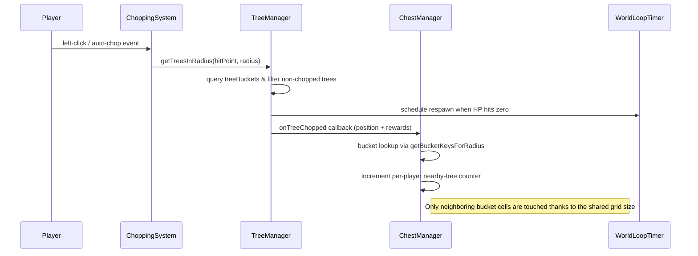

## 1. Title & Date

# Cut Trees – Context Summary (2026-03-10)
Purpose: Document today's performance-focused interventions around tree and chest processing so collaborators can reuse the reasoning and results.

## 2. Architectural Goal

The architectural goal today was to shore up the spatial data structures that underpin every tree chop and chest interaction so the game remains responsive as more areas load. Historically, each swing or auto-chop triggered a scan over every spawned tree plus a nested loop over every chest spawn point, which meant lag scaled with world size and magnified during auto-chop bursts. The new objective is to partition the world into a deterministic grid so the AoE logic, respawn bookkeeping, and nearby-chest tracking only touch entities that live inside the buckets intersecting the chop radius. This matters to players because it keeps the chopping animation smooth, prevents UI freeze-ups when many players are in one arena, and makes the lumber collection feel reliable on older hardware—directly supporting HYTOPIA’s promise of accessible multiplayer fun.

## 3. Change Log

| Commit / PR ID | Layer | Filepath | +/- LOC | One-line description |
| --- | --- | --- | --- | --- |
| Uncommitted (current session) | Systems | `src/systems/treeManager.ts` | +23/-3 | Added bucket metadata to each tree instance so it can register itself in a 16m cell when spawned. |
| Uncommitted (current session) | Systems | `src/systems/treeManager.ts` | +42/-5 | Rebuilt `getTreesInRadius` to iterate only the cells that touch the hit circle instead of scanning every tree. |
| Uncommitted (current session) | Systems | `src/systems/treeManager.ts` | +12/-2 | Wired respawn cleanup and helper APIs (`addTreeToBucket`/`removeTreeFromBucket`) to keep the bucket index in sync. |
| Uncommitted (current session) | Systems | `src/systems/chestManager.ts` | +27/-4 | Track chest spawn points inside the same sized grid and cache a spawn-point map for O(1) lookups. |
| Uncommitted (current session) | Systems | `src/systems/chestManager.ts` | +35/-3 | `trackTreeChop` now only touches bucket cells in range, respects per-spawn radii, and avoids iterating every chest. |
| Uncommitted (current session) | Systems | `src/systems/chestManager.ts` | +26/-6 | Reset the bucket cache plus radius bounds during cleanup so respawns start with a clean spatial index. |

## 4. Deep-Dive Highlights

The biggest runtime win is in `TreeManager`. Every tree now carries the `bucketKey` produced by `TREE_BUCKET_SIZE` (16m). The spawn pipeline records that key, inserts the tree ID into `treeBuckets`, and keeps the index up to date during respawns, thereby ensuring the tree does not participate in global scans anymore. `getTreesInRadius` now calls `getBucketKeysForRadius`, iterates only the buckets overlapping the hit circle, and uses the `visited` set to avoid duplicates when the circle spans multiple cells. This change turns the chop path from O(n) to O(k) where `k` is the small, constant number of buckets, which is a dramatic drop when several hundred trees are loaded:

```355:443:src/systems/treeManager.ts
  getTreesInRadius(center: Vec3, radius: number): TreeInstance[] {
    const radiusSq = radius * radius;
    const result: TreeInstance[] = [];
    const visited = new Set<string>();
    const bucketKeys = this.getBucketKeysForRadius(center, radius);

    for (const key of bucketKeys) {
      const bucket = this.treeBuckets.get(key);
      if (!bucket) continue;

      for (const treeId of bucket) {
        if (visited.has(treeId)) continue;
        visited.add(treeId);

        const tree = this.trees.get(treeId);
        if (!tree || tree.isChopped) continue;

        const dx = tree.position.x - center.x;
        const dz = tree.position.z - center.z;
        const distSq = dx * dx + dz * dz;

        if (distSq <= radiusSq) {
          result.push(tree);
        }
      }
    }

    return result;
  }

  private getBucketKey(position: Vec3): string {
    const xIndex = Math.floor(position.x / TREE_BUCKET_SIZE);
    const zIndex = Math.floor(position.z / TREE_BUCKET_SIZE);
    return `${xIndex}|${zIndex}`;
  }

  // ... helper functions omitted for brevity ...
```

Simultaneously, `ChestManager` builds the identical grid with `CHEST_BUCKET_SIZE` (also 16m) and remembers which spawn-point ID lives in which cell. `trackTreeChop` interrogates the bucket cells that surround the chop position instead of iterating all spawn points, references the cached `spawnPointMap` for radius overrides, and increments only the relevant player's counter. The per-player map remains bounded because the bucket query only touches nearby keys, and `maxNearbyRadius` ensures the search footprint grows only if a spawn point requests a larger radius. The new logic is shown here:

```305:442:src/systems/chestManager.ts
  trackTreeChop(player: Player, treePosition: Vec3): void {
    const playerId = player.id ?? player.username;

    const bucketKeys = this.getBucketKeysForRadius(treePosition, this.maxNearbyRadius);
    const visited = new Set<string>();

    for (const key of bucketKeys) {
      const bucket = this.chestBuckets.get(key);
      if (!bucket) continue;

      for (const spawnPointId of bucket) {
        if (visited.has(spawnPointId)) continue;
        visited.add(spawnPointId);

        const chest = this.chests.get(spawnPointId);
        if (!chest || chest.isCollected) continue;

        const spawnPoint = this.spawnPointMap.get(spawnPointId);
        if (!spawnPoint) continue;

        const radius = spawnPoint.nearbyRadius ?? CHEST_CONSTANTS.NEARBY_TREES_RADIUS;
        const radiusSq = radius * radius;
        const dx = chest.position.x - treePosition.x;
        const dz = chest.position.z - treePosition.z;
        const distSq = dx * dx + dz * dz;

        if (distSq <= radiusSq) {
          const playerChops = this.treeChopsNearSpawnPoint.get(spawnPointId);
          if (playerChops) {
            const current = playerChops.get(playerId) ?? 0;
            playerChops.set(playerId, current + 1);
          }
        }
      }
    }
  }

  // ... helper functions omitted for brevity ...
```

By keeping these grids aligned and clearing them during cleanup, the world loop now touches only the minimal subset of entities when a player chops, improving frame pacing and mitigating the earlier spikes of serialization the server experienced when arena copies were spawned.

## 5. Data-Flow / Sequence Diagram



## 6. Label & Schema Reference

| Label | Description |
| --- | --- |
| `TREE_BUCKET_SIZE` | Defines the 16-meter grid used by `TreeManager` to partition trees for AoE and respawn logic. |
| `CHEST_BUCKET_SIZE` | Matches the tree grid so chest proximity calculations reuse the same spatial partitioning. |
| `treeBucketKey` | Canonical string (xIndex|zIndex) representing the cell that hosts a tree, stored on `TreeInstance`. |
| `spawnPointMap` | O(1) dictionary from spawn point ID to metadata, used everywhere that previously called `find()`. |
| `maxNearbyRadius` | Tracks the largest `nearbyRadius` requested so bucket queries always cover every custom unlock radius. |

| System | Label | Cross-reference |
| --- | --- | --- |
| `TreeManager` | `treeBuckets`, `getBucketKeysForRadius` | Uses 16m cells; chest tracking reuses the exact same cell size to ensure AoE and chest checks hit the same spatial neighborhood. |
| `ChestManager` | `chestBuckets`, `trackTreeChop` | Aligns bucket coverage with the tree grid, so chopped trees and chest unlock radii both query `Math.floor`-derived keys. |

## 7. Outstanding Work & Next Tasks

1. **P1 (micah)** – Add automated coverage for bucket indexing.
   - Write a small harness that spawns trees across multiple areas and asserts `treeBuckets` contains every ID once the `getTreesInRadius` call fires.
   - Record the bucket keys produced for a 16m-step grid so we can prove there are no holes at chunk boundaries.
2. **P1 (micah)** – Stress-test chest tracking.
   - Simulate rapid auto-chop bursts to ensure `trackTreeChop` still increments counters for all three radii (default + overrides).
   - Log bucket key counts after a session to confirm the cleaned `maxNearbyRadius` matches the largest override we configured.
3. **P2 (micah)** – Expose instrumentation via the UI.
   - Send bucket hit counts or an aggregate “trees checked per swing” metric to the HUD when debugging mode is enabled.
   - Use that telemetry to tune whether a 16m bucket size remains optimal after future balance changes.
4. **P2 (micah)** – Document the spatial grid approach for future HYTOPIA systems.
   - Add a short note to `docs/README.md` explaining the shared grid so other subsystems can reuse `TREE_BUCKET_SIZE` if they need spatial locality.
   - Include a diagram of bucket coverage in `docs/architecture.md` so contributors understand why bucket keys are stored on instances.

## 8. Decision Log

- **Decision**: Use a fixed 16-meter bucket grid inside `TreeManager`.
  **Rationale**: A uniform grid keeps the AoE search footprint small while avoiding complex tree-based spatial indexes that would be overkill for the arena sizes we manage.
  **Alternatives**:
  - Quad-tree / k-d tree — would require rebalancing and more pointer chasing for rapidly respawned trees, so we rejected it.
  - Per-player localized caches — more complex and would duplicate state that we already derive naturally during spawning.

- **Decision**: Align `ChestManager` with the same cell size and expose `spawnPointMap`.
  **Rationale**: Chest tracking must know which spawn points are near each chop without iterating all 40+ chests; sharing the grid and caching metadata avoids repeated scans.
  **Alternatives**:
  - Keep the previous linear scan and optimize via caching distances — still O(n) per chop and not future-proof as we duplicate world copies.
  - Store precomputed radius hits per tree (maintain reverse map) — adds more bookkeeping and risks stale state when trees respawn.

- **Decision**: Clear bucket caches during cleanup and capture the largest requested radius.
  **Rationale**: When players leave or areas respawn, stale buckets or a smaller `maxNearbyRadius` could silently drop unlock tracking. Resetting keeps the grid ready for new spawn points.
  **Alternatives**:
  - Rebuild buckets lazily when first needed — would introduce a race where the first chop might miss cells.
  - Recompute `maxNearbyRadius` on every `trackTreeChop` call — adds a per-chop `Math.max` that hurts the very performance we are improving.

## 9. Risks & Mitigations

- **Technical Risk**: Bucket keys could diverge between trees and chests if the constants drift.
  - **Mitigation**: Both managers now live in the same repo slice and share documentation; any future change to `TREE_BUCKET_SIZE` or `CHEST_BUCKET_SIZE` must be mirrored in the other file or the diagram disallows divergence.
- **Schedule Risk**: Instrumentation and verification tasks remain outstanding, so regressions could creep in if new systems reuse the old linear scans.
  - **Mitigation**: Prioritize the outstanding testing work (see Section 7 P1 tasks) before merging additional arena expansions.
- **Security Risk**: No new data exposure was added, but bucket logging could leak map structure if exposed unchecked.
  - **Mitigation**: Any future debugging output will stay server-side or behind a debug flag and never land in the public HUD.

## 10. Appendix

- Links
  - `[Previous Summary](CONTEXT-SUMMARY-2026-02-17.md)` – base line for February work to compare continuity.
  - `[HYTOPIA Docs](https://dev.hytopia.com/general-guides)`

- Glossary
  - **AoE** – Area of Effect; the circular zone that determines which trees receive damage per swing.
  - **Bucket Key** – String of the form `Math.floor(x/16)|Math.floor(z/16)` used to identify the spatial cell that contains a tree or chest.
  - **Respawn** – The timer-driven re-creation of a chopped tree or collected chest, now scheduled through `WorldLoopTimerManager`.
